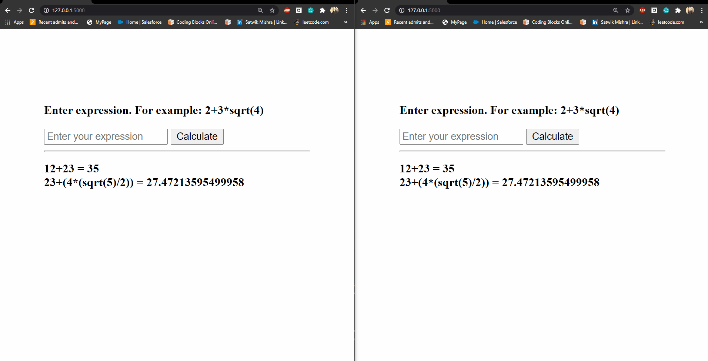

# Sezzle
Chanllenge Description: A calculator website which logs calculations as they happen and shares those calculations with everyone connected to the website. For example, user A and user B go to your site at the same time. User A calculates "5 + 5", which equals "10". This is logged below the calculator as "5+5 = 10". User B is updated about this calculation right after user A posts it. Now, user B calculates "3*4". This calcs to 12 and displays "3*4=12" right below the prior calculation. User A sees this update immediately after user B posts it. Results should remain between sessions. Only show the last 10 calculations descending from most recent to oldest.

## Backend:
I have used flask and socket.io for real time updates.  

## API for math calculations:
https://api.mathjs.org/

## For maintaining calculations between sessions
Used local strorage. 

## To run on localhost
1. Download the repo
2. Run `python app.py` from the terminal. 

## On localhost connecting from multiple tabs

## Deployment
Not successfull, tried deploying on heroku. 
https://sezzle-satwik-calculator.herokuapp.com/ 

